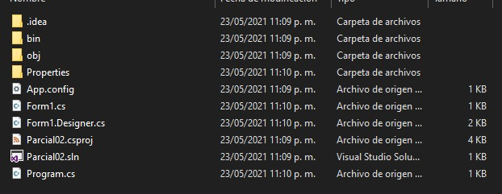
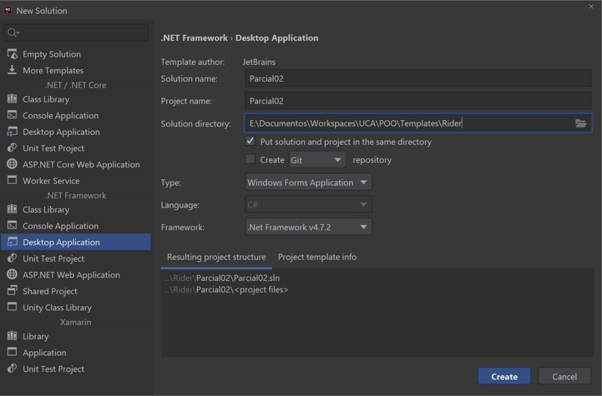
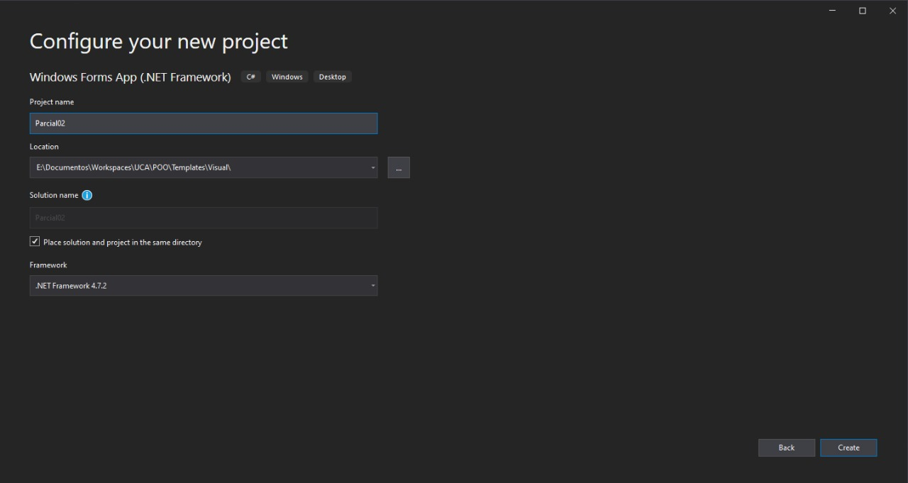

# Clínica UCA: sistema de reserva de citas

## Etapas I: Interfaz gráfica

### Formulario de inicio de sesión:
Ventana que solicita usuario y contraseña, debe mostrar mensajes de error si el usuario no se encuentra en la base de datos. Debe contener botones para crear usuario, cambiar contraseña e iniciar sesión.

### Formulario de creación de usuario: 
Ventana que solicita carné (será el id), nombre de usuario, contraseña (repetir para verificar), pregunta de seguridad (habrá un conjunto de preguntas por defecto) y respuestas de seguridad (se utilizará cuando el usuario haya olvidado su contraseña y desee actualizarla).

### Formulario de cambio de contraseña: 
Ventana que en primer lugar solicita el carné, luego muestra la pregunta de seguridad que se tiene. Finalmente cuando el usuario digite la respuesta correcta, le ofrecerá la posibilidad de actualizar la contraseña.

### Formulario principal:
Ventana que permite realizar las siguientes acciones.
- Reserva de citas: permite crear una cita a partir del carné del usuario, una fecha y hora; además se debe solicitar la especialidad médica.
- Visualización de citas existentes: tabla que despliega un detalle de las reservas realizadas, deberá mostrar una imagen correspondiente a la especialidad de cada cita.
- Actualización y cancelación de citas: al darle clic a una cita en la visualización, se debe mostrar en otra pestaña el detalle de dicha cita; ofreciéndole al usuario la posibilidad de actualizar datos o, eliminarla.

## Etapa 2: entidades del modelo.

### Usuario: contiene los siguientes campos.
- Carné (llave primaria).
- Nombre completo.
- Contraseña.
- Referencia a la pregunta de seguridad (llave foránea).
- Respuesta a la pregunta de seguridad.

### Pregunta de seguridad: catálogo que contiene las posibles preguntas de seguridad (el usuario no puede digital cualquiera, sino solo las predefinidas).
- ¿En qué año naciste?
- ¿Cómo se llamó tu primer mascota?
- ¿De qué colegio te graduaste de bachiller?
- ¿Nombre de tu película favorita?

### Reserva: contiene los siguientes campos:
- Id de reserva (autoincrementable).
- Referencia al usuario (llave foránea).
- Referencia a la especialidad (llave foránea).
- Fecha y hora de la cita.

### Especialidad: catálogo que contiene las especialidades de la clínica UCA.
- Medicina general.
- Odontología.
- Psicología.
- Oftalmología.

## Etapa 3: requisitos técnicos.
- Se debe utilizar Entity Framework para la conexión a la base de datos.
- Se puede utilizar ya sea SQL Server o MySQL como gestor de bases de datos.
- El clan decidirá si se trabaja en Rider o en Visual Studio, no se permite en ambos.
- Controles a utilizar de manera obligatoria: Label, Button, Text Box, Combo Box, Tab Control, Picture Box, Data Grid View y Table Layout Panel.
- Controles a utilizar de manera opcional: Group Box, Numeric Up Down, Rich Text Box, Status Strip o Menu Strip; y cualquier otro visto en la materia.
- Las imágenes de las especialidades deben ser almacenadas en los recursos del proyecto.
- Realizar todas las validaciones que consideren pertinentes, aplicando manejo de excepciones donde sea necesario.
- Se debe entregar diagramas UML de clase y casos de uso.
- Hacer uso de buenas prácticas.

## Etapa 4: trabajo colaborativo.
Deberán realizar el trabajo en distintas ramas para separar responsabilidades:
- Rama usuario: contiene las tres ventanas que tienen que ver con el usuario.
- Rama citas: contiene la ventana principal, y su lógica de negocio.
- Rama modelo: contiene el trabajo de la creación de entidades.
- Rama master/main: rama donde se combine el trabajo desarrollado en las demás ramas, esta será la que se calificará.

### Ejemplo de visualización de Ramas por nodos

```
master      o ------- o -- o ------- o -- o -- o -- o
            |         |    |         |    |    |
usuario     u -- u -- u    |         |    |    |
                           |         |    |    |
citas                      c -- c -- c    |    |
                                          |    |
modelo                                    m -- m
```

## Etapa 5: funcionalidades extra.
- Medio punto extra si se entrega diagrama UML de secuencias (proceso de reservar una cita).
- Medio punto extra si se utilizan colores agradables al usuario, que sean consistentes a lo largo de todas las ventanas. Estandarizar el diseño de las ventanas: fuentes, tamaños, controles, ubicación de los mismos, entre otros.
- Un punto extra si se consiguen cuatro respuestas distintas (cada miembro del clan, más dos personas que NO hayan estudiado informática) a la encuesta (adjuntar las 4 capturas de pantalla).
[Formulario](https://docs.google.com/forms/d/e/1FAIpQLSflpOfxRFIceESL1IFm-HpWXRcYx_YWmMz6Jbej2ExPTxOCng/viewform)

------------------
# Fecha de entrega:
### Base 10 
Hora límite: miércoles 26 de mayo a las 23:59.

### Base 6 
Hora límite: jueves 27 de mayo a las 05:59.
### No se recibirán entregas
Posteriores al jueves 27 de mayo a las 6:00.


---------------------


# Creación de proyecto

## Indicaciones:

Deberá crear su solución en una carpeta llamada ***Parcial02***, encontrándose el proyecto y la solución en el mismo directorio.

Visualización del repositorio:


Visualización de la carpeta ***Parcial02***:



Para la creación desde **Rider**, basarse en el siguiente ejemplo: 



Para la creación desde **Visual Studio Community**, basarse en el siguiente ejemplo: 

